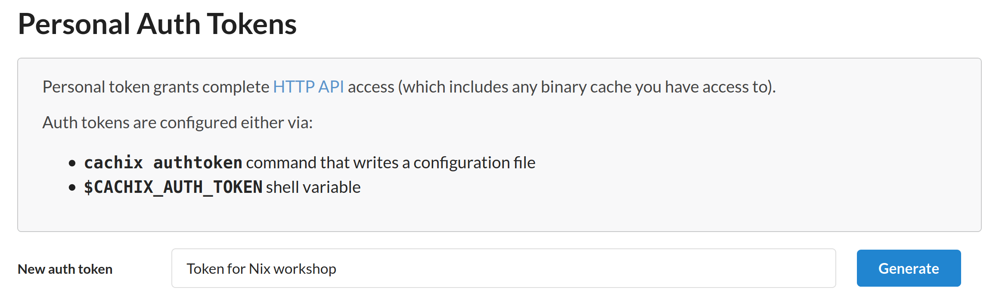
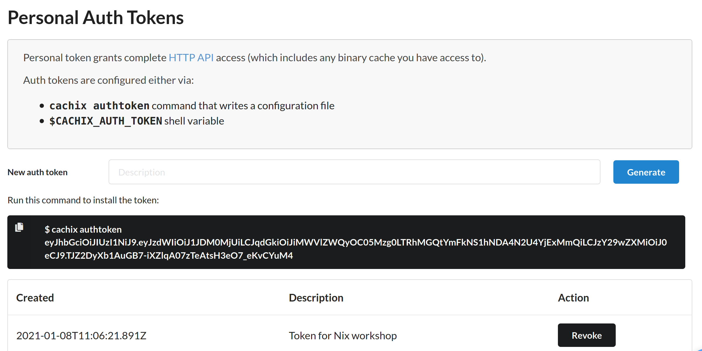

# Caching Nix Packages

Nix can be used to build all kinds of packages from the ground up. A Nix
packages can be as simple as a hello world output, or as large as projects
such as GHC and GCC. If every time we try to build our Nix package from
scratch together with all its dependencies, it is going to take unreasonably
long time.

Fortunately, NixOS provides
[a cache for most packages provided by nixpkgs](https://cache.nixos.org).
The cache is usually enabled by default in your local `nix.conf` file.
Thanks to this, we can simply download the packages in nixpkgs instead of
building them from scratch.

The default cache from cache.nixos.org is usually sufficient if we are
just using Nix to build small projects. But what if we are using Nix to
build large projects that take hours to build? What if we need to
use Nix to build something like
[`fib(50)`](../04-derivations/03-fibonacci/fib.nix)?

## Cachix

[Cachix](https://cachix.org/) is a cloud service for us to easily host our
own Nix cache. The service is free to use for public cache, and paid plan
is available for private Nix cache.

Other than Cachix, there are other options available for hosting Nix cache,
such as [nix-serve](https://github.com/edolstra/nix-serve) and
[hydra](https://github.com/NixOS/hydra). However they require rolling up your
own infrastructure to host the servers, which can take quite a bit of effort.

Cachix is by far the easiest way to setup a Nix cache. In this section we
will go through the details of caching Nix packages using Cachix.
There are also [official documentation](https://docs.cachix.org) available
on using Cachix, which you should check out.

To get started using Cachix, first sign up for an account at
https://app.cachix.org/signup. Or if you have already signed up, login
at https://app.cachix.org/login. After logging in, create a new
binary cache at https://app.cachix.org/cache.


Choose a unique name for your cache. For write access, leave with the default
option "API tokens". We will also use the default public read access,
since our test cache do not contain sensitive data.

After creating the cache, we will also need to create an auth token to
push to our cache. Go to https://app.cachix.org/personal-auth-tokens
to generate one.



Enter a suitable description for your Cachix token, then click the "Generate"
button.



The web page will then show us the generated token, which we can later
enter in our shell. For the purpose of this workshop, also save the
auth token as `cachix-token` in the [nix-workshop/config](../../config)
directory. (Remember to exclude the `cachix authtoken` prefix).

You should keep the generated token secret, as it can be used to push to
the Cachix store you own, as well as accessing private cache.
Having a proper description can help us identify the tokens that we are
no longer using, so that we can revoke them at a later time.

Now that we have setup our Cachix account, we can install Cachix on our local
machine using Nix:

```bash
$ nix-channel --update
...
$ nix-env -i cachix
...
$ cachix --version
cachix 0.6.0
```

At the point of writing the version of our `cachix` command is `0.6.0`.
We can then configure Nix to use our Cachix store by running:

```bash
cachix use my-awesome-nix-cache
```

(Replace the store name `my-awesome-nix-cache` with the Cachix store name
that you have created)


## Docker

It is difficult to test whether a Nix cache works when using a single machine.
Since Nix also locally caches a Nix package after building it, we can't
really verify locally that Nix will download from our cache the next
time we build it on a fresh machine.

Although we could force rebuild everything using `nix-collect-garbage`, that
would also destroy all local builds we have. So we might not want to use that
nuclear option.

For the purpose of this workshop, we provide a [Dockerfile](../../Dockerfile)
that you can use to enter an Ubuntu Docker container with fresh Nix environment.
You can enter the container by simply running:

```bash
make docker
```

Inside the docker container, you can run as the `nix` user with the workshop
directory mounted at `~/nix-workshop`.

The Docker container is started with the `--rm` option, so storage for the
local Nix store is reclaimed when you exit the container. You can run
multiple copies of the container in separate shell, to test whether the
Nix packages are cached properly.

We still have to configure our Docker container to use the Cachix store
that we have just created. To simplify the configuration, save your
Cachix credentials in [nix-workshop/config](../../config), with
the file `cachix-store` containing the name of your Cachix store,
and `cachix-token` containing the auth token we have just created
earlier.

When entering the Docker container, it will automatically source
[`scripts/setup.sh`](../../scripts/setup.sh) to read the config
files and run the following:

```bash
CACHIX_STORE=$(cat ~/nix-workshop/config/cachix-store)
cachix use $CACHIX_STORE
cachix authtoken $(cat ~/nix-workshop/config/cachix-token)
```

## Caching Fibonacci

Now that our Cachix store is setup properly, we can try to actually
cache some Nix builds.
We will reuse the [`fib.nix`](../04-derivations/03-fibonacci/fib.nix)
derivation that we defined in earlier
[chapter](../04-derivations/03-fibonacci.md).

First of all, we use `nix-instantiate` to instantiate our Nix derivation,
and then save the result into `$drv`. We will create the `fib(4)` derivation
with the prefix `"foo"`. (You can choose your own prefix here)

```bash
$ drv=$(nix-instantiate -E '
  import ./code/04-derivations/03-fibonacci/fib.nix
    "foo" 4
')
...
warning: you did not specify '--add-root'; the result might be removed by the garbage collector
```

When running `nix-instantiate`, it will produce the warning line
`warning: you did not specify '--add-root' ...` which we can usually ignore.

Now we can build `$drv`, which can take a while to finish.

```bash
$ echo $drv
/nix/store/a4qb7vq7ws2q01jd5a07zpml5hw381nl-foo-fib-4.drv

$ nix-build --no-out-link $drv
...
/nix/store/zdq2p21pq836n3k1xkh4yb8wkvl9fy0l-foo-fib-4
```

### Single Build Output

Now that we have built our derivation, how do we actually cache it using
Cachix? At the most basic level, we can use `cachix push` to push
a particular Nix store path to Cachix:

```bash
$ nix-build --no-out-link $drv | cachix push $CACHIX_STORE
compressing and pushing /nix/store/zdq2p21pq836n3k1xkh4yb8wkvl9fy0l-foo-fib-4 (288.00 B)
All done.
```

In our naive attempt, we simply pipe the build output path of `fib(4)` to
`cachix push`. From the output we can see that Cachix has pushed a single path to
our store.

Now if we try to build `fib(4)` again in another container, we can see that
Nix would fetch the result directly from Cachix:

```
$ nix-build --no-out-link $drv
these paths will be fetched (0.00 MiB download, 0.00 MiB unpacked):
  /nix/store/zdq2p21pq836n3k1xkh4yb8wkvl9fy0l-foo-fib-4
copying path '/nix/store/zdq2p21pq836n3k1xkh4yb8wkvl9fy0l-foo-fib-4' from 'https://scrive-nix-workshop.cachix.org'...
/nix/store/zdq2p21pq836n3k1xkh4yb8wkvl9fy0l-foo-fib-4
```

Everything looks fine so far. But in fact `fib(0)` to `fib(3)` have
not yet been cached in our store. So Nix will still have to rebuild
the dependencies when they are needed, such as when entering
Nix shell:

```bash
$ nix-shell $drv
these derivations will be built:
  /nix/store/6mc3ccymdyfmqacrq5vyc43zb2gl81ml-foo-fib-1.drv
  /nix/store/hj0g7hn703axx44x29l27xb1nrdg83rh-foo-fib-0.drv
  /nix/store/k65i01s85dix9xcgxyaggc8l13lx1rrz-foo-fib-2.drv
  /nix/store/wgcp26v3g23x9i9iqiirn20pgmv4mgki-foo-fib-3.drv
```

The dependencies also need to be rebuilt when we try to build something like
`fib(6)`, which depends on not only `fib(4)` but also `fib(3)`:

```bash
$ drv=$(nix-instantiate -E '
  import ./code/04-derivations/03-fibonacci/fib.nix
    "foo" 6
')
$ nix-build --no-out-link $drv
these derivations will be built:
  /nix/store/6mc3ccymdyfmqacrq5vyc43zb2gl81ml-foo-fib-1.drv
  /nix/store/hj0g7hn703axx44x29l27xb1nrdg83rh-foo-fib-0.drv
  /nix/store/k65i01s85dix9xcgxyaggc8l13lx1rrz-foo-fib-2.drv
  /nix/store/wgcp26v3g23x9i9iqiirn20pgmv4mgki-foo-fib-3.drv
  /nix/store/m3sspba1wz9ffp5qyjplg8fjbnhy7d73-foo-fib-5.drv
  /nix/store/zyhq28hxak4jk7xak6lixa4lbfxdjwvz-foo-fib-6.drv
...
```

### How `cachix push` works

The `cachix push` command works by reading the Nix store paths from STDIN,
and push each of the path to the specified Cachix store. More specifically,
`cachix push` pushes the _closure_ of the Nix path.

For the case above, the build result of `fib(4)` does not have any runtime
dependency, so only the build itself is pushed to Cachix.

We can also try pushing `fib-4.drv` itself to Cachix, and we can see that
it pushes the `.drv` derivation of all its dependencies as well.

```
$ echo $drv | cachix push $CACHIX_STORE
compressing and pushing /nix/store/0hfyfy1wxlri4gdcmikg7v0ybvpkl3yl-Python-3.8.6.tar.xz.drv (856.00 B)
compressing and pushing /nix/store/0vjq3889mc2z9v02hcw072ay0fivbshx-nuke-references.drv (1.41 KiB)
compressing and pushing /nix/store/0rgf63snfi078knpghs1jf2q3913gd17-bootstrap-stage4-gcc-wrapper-10.2.0.drv (7.05 KiB)
...
compressing and pushing /nix/store/hj0g7hn703axx44x29l27xb1nrdg83rh-foo-fib-0.drv (1.41 KiB)
...
```


Similarly if we instead try to push the build result of
[`upper-greet.nix`](../04-derivations/02-dependencies/upper-greet.nix),
we can see that the build result of
[`greet.nix`](../04-derivations/02-dependencies/greet.nix) is pushed as well.

```bash
$ drv=$(nix-instantiate ./code/04-derivations/02-dependencies/upper-greet.nix)
$ nix-build --no-out-link $drv | cachix push $CACHIX_STORE
these derivations will be built:
  /nix/store/wirssa651gwxv6z8ik78ac05c7f9ml3b-greet.drv
  /nix/store/aqznnbrbplwm2mvybzhp6wxw5inrq2aj-upper-greet.drv
...
compressing and pushing /nix/store/391ab6p11dh6gk4crc9a8pxym7c2v7lc-upper-greet (704.00 B)
compressing and pushing /nix/store/ws8lpdazs14zjcsgifkpdy060qsiakk6-greet (568.00 B)
All done.
```

However for neither approach can push the build output of `fib(0)` to `fib(3)`,
which are _build dependencies_ of `fib(4)`.

### Caching Build Dependencies

In practice, when we are are caching a derivation such as `fib(4)`, we would also
want to cache it together with all its build dependencies, including `fib(0)` to
`fib(3)` which we have just built. To do that we have to use `cachix push` together
with other Nix commands.

Recall that the `nix-store -qR` command gives us all the dependencies of a
derivation:

```bash
$ nix-store -qR $drv
/nix/store/01n3wxxw29wj2pkjqimmmjzv7pihzmd7-which-2.21.tar.gz.drv
/nix/store/03f77phmfdmsbfpcc6mspjfff3yc9fdj-setup-hook.sh
...
```

We can `grep` specifically for the `fib` dependencies that we are interested in:

```bash
$ nix-store -qR $drv | grep fib-
/nix/store/6mc3ccymdyfmqacrq5vyc43zb2gl81ml-foo-fib-1.drv
/nix/store/hj0g7hn703axx44x29l27xb1nrdg83rh-foo-fib-0.drv
/nix/store/k65i01s85dix9xcgxyaggc8l13lx1rrz-foo-fib-2.drv
/nix/store/wgcp26v3g23x9i9iqiirn20pgmv4mgki-foo-fib-3.drv
/nix/store/a4qb7vq7ws2q01jd5a07zpml5hw381nl-foo-fib-4.drv
```

To push the build result of all dependencies, we can add the
`--include-outputs` option:

```bash
$ nix-store -qR --include-outputs $drv | grep fib-
/nix/store/20flzbyx97kly3n34krlmjg9awjn6a5z-foo-fib-3
/nix/store/52j5p1a03vi8dxn7rh4s8y6n5ml318rq-foo-fib-0
/nix/store/6mc3ccymdyfmqacrq5vyc43zb2gl81ml-foo-fib-1.drv
/nix/store/hj0g7hn703axx44x29l27xb1nrdg83rh-foo-fib-0.drv
/nix/store/k65i01s85dix9xcgxyaggc8l13lx1rrz-foo-fib-2.drv
/nix/store/wgcp26v3g23x9i9iqiirn20pgmv4mgki-foo-fib-3.drv
/nix/store/a4qb7vq7ws2q01jd5a07zpml5hw381nl-foo-fib-4.drv
/nix/store/c7lwn4mfn3pk0hhvc98lg1r6z6c8pb6c-foo-fib-1
/nix/store/qih0iazs5yl3dg694a2fz0jzzlxzy7k8-foo-fib-2
/nix/store/zdq2p21pq836n3k1xkh4yb8wkvl9fy0l-foo-fib-4
```

Finally, we don't really need to push the `.drv` files themselves
to Cachix, as Nix always regenerate them during evaluation of the
`.nix` files. We can use `grep -v` to exclude them:

```bash
$ nix-store -qR --include-outputs $drv | grep -v .drv | grep fib-
/nix/store/20flzbyx97kly3n34krlmjg9awjn6a5z-foo-fib-3
/nix/store/52j5p1a03vi8dxn7rh4s8y6n5ml318rq-foo-fib-0
/nix/store/c7lwn4mfn3pk0hhvc98lg1r6z6c8pb6c-foo-fib-1
/nix/store/qih0iazs5yl3dg694a2fz0jzzlxzy7k8-foo-fib-2
/nix/store/zdq2p21pq836n3k1xkh4yb8wkvl9fy0l-foo-fib-4
```

Now that we got the list of build outputs to push, we can then pipe them
to `cachix push`:


```bash
$ nix-build $drv && nix-store -qR --include-outputs $drv | grep -v .drv | cachix push $CACHIX_STORE
compressing and pushing /nix/store/20flzbyx97kly3n34krlmjg9awjn6a5z-foo-fib-3 (288.00 B)
compressing and pushing /nix/store/52j5p1a03vi8dxn7rh4s8y6n5ml318rq-foo-fib-0 (288.00 B)
compressing and pushing /nix/store/c7lwn4mfn3pk0hhvc98lg1r6z6c8pb6c-foo-fib-1 (288.00 B)
compressing and pushing /nix/store/qih0iazs5yl3dg694a2fz0jzzlxzy7k8-foo-fib-2 (288.00 B)
compressing and pushing /nix/store/zdq2p21pq836n3k1xkh4yb8wkvl9fy0l-foo-fib-4 (288.00 B)
All done.
```

This time if we try to build `fib(6)` on a fresh machine, it will download the cache
result of both `fib(3)` and `fib(4)` from Cachix:

```bash
$ nix-build -E '
  import ./code/04-derivations/03-fibonacci/fib.nix
    "foo" 6
'
these derivations will be built:
  /nix/store/m3sspba1wz9ffp5qyjplg8fjbnhy7d73-foo-fib-5.drv
  /nix/store/zyhq28hxak4jk7xak6lixa4lbfxdjwvz-foo-fib-6.drv
these paths will be fetched (61.76 MiB download, 260.53 MiB unpacked):
  /nix/store/20flzbyx97kly3n34krlmjg9awjn6a5z-foo-fib-3
  /nix/store/zdq2p21pq836n3k1xkh4yb8wkvl9fy0l-foo-fib-4
  ...
building '/nix/store/m3sspba1wz9ffp5qyjplg8fjbnhy7d73-foo-fib-5.drv'...
...
building '/nix/store/zyhq28hxak4jk7xak6lixa4lbfxdjwvz-foo-fib-6.drv'...
...
/nix/store/vrzxqqj6q11lgpizsd78r2cx2c7zfban-foo-fib-6
```

## Evaluation-time Dependencies

As mentioned in
[chapter 14](../04-derivations/03-fibonacci.md#evaluation-time-dependencies),
It is much more tricky to find the evaluation time dependencies and
push them to Cachix.

If we try to Cache the build dependencies of
[`fib-serialized.nix`](../04-derivations/03-fibonacci/fib-serialized.nix),
it wouldn't really workd.


```bash
$ drv=$(nix-instantiate -E '
  import ./code/04-derivations/03-fibonacci/fib-serialized.nix
    "foo" 4
')
building '/nix/store/6mc3ccymdyfmqacrq5vyc43zb2gl81ml-foo-fib-1.drv'...
...
building '/nix/store/hj0g7hn703axx44x29l27xb1nrdg83rh-foo-fib-0.drv'...
...
building '/nix/store/bg0kqrl14p99y1k0g47gcx7a4ik4qk1m-foo-fib-3.drv'...
...

$ nix-build $drv && nix-store -qR --include-outputs $drv | grep -v .drv | cachix push $CACHIX_STORE
compressing and pushing /nix/store/rlllddnljlv1qzlizdr97q5wbzlqpq5k-foo-fib-4 (288.00 B)
All done.
```

At this point, there is no simple way to find out all evaluation time
dependencies to push. But in case we really want to push all evaluation time
dependencies, there is still one nuclear option.

## Push All Nix Derivations

`cachix push` provides a `watch-exec` command to watch the global Nix
store, and push _all_ new paths that are added to the Nix store during the
execution of our command.

```bash
$ cachix watch-exec $CACHIX_STORE nix-build -- \
  --no-out-link \
  -E 'import ./code/04-derivations/03-fibonacci/fib-serialized.nix
    "foo" 4'
...
Watching /nix/store for new store paths ...
building '/nix/store/hj0g7hn703axx44x29l27xb1nrdg83rh-foo-fib-0.drv'...
compressing and pushing /nix/store/52j5p1a03vi8dxn7rh4s8y6n5ml318rq-foo-fib-0 (288.00 B)
building '/nix/store/6mc3ccymdyfmqacrq5vyc43zb2gl81ml-foo-fib-1.drv'...
...
compressing and pushing /nix/store/c7lwn4mfn3pk0hhvc98lg1r6z6c8pb6c-foo-fib-1 (288.00 B)
building '/nix/store/74x1nl7paqin5zcrkkj94bbkm25shpx9-foo-fib-2.drv'...
...
compressing and pushing /nix/store/ia5arkikhbyd9drjzxm2lqgr5a1b6n9m-foo-fib-2 (288.00 B)
building '/nix/store/bg0kqrl14p99y1k0g47gcx7a4ik4qk1m-foo-fib-3.drv'...
...
compressing and pushing /nix/store/ykvgv0hvpm93glrjzpyb7hkashq5rr1q-foo-fib-3 (288.00 B)
these derivations will be built:
  /nix/store/m25lspbpyv09vl3pz3sf3q20ndcrilq9-foo-fib-4.drv
building '/nix/store/m25lspbpyv09vl3pz3sf3q20ndcrilq9-foo-fib-4.drv'...
...
/nix/store/rlllddnljlv1qzlizdr97q5wbzlqpq5k-foo-fib-4
Stopped watching /nix/store and waiting for queue to empty ...
compressing and pushing /nix/store/rlllddnljlv1qzlizdr97q5wbzlqpq5k-foo-fib-4 (288.00 B)
Waiting to finish: 1 pushing, 0 in queue
Done.
```

We can see during the build that Nix pushes a lot of things to Cachix, including
the downloaded tarballs from sources like nixpkgs,
which are in fact also evaluation time dependencies.

Now if we go to a fresh machine and try to build `fib-serialized`, we can see
that this time it is correctly downloading the build results of `fib(0)` to
`fib(4)` from Cachix:

```bash
$ nix-build -E '
  import ./code/04-derivations/03-fibonacci/fib-serialized.nix
    "foo" 6'
...
copying path '/nix/store/c7lwn4mfn3pk0hhvc98lg1r6z6c8pb6c-foo-fib-1' from 'https://scrive-nix-workshop.cachix.org'...
copying path '/nix/store/52j5p1a03vi8dxn7rh4s8y6n5ml318rq-foo-fib-0' from 'https://scrive-nix-workshop.cachix.org'...
copying path '/nix/store/ia5arkikhbyd9drjzxm2lqgr5a1b6n9m-foo-fib-2' from 'https://scrive-nix-workshop.cachix.org'...
copying path '/nix/store/ykvgv0hvpm93glrjzpyb7hkashq5rr1q-foo-fib-3' from 'https://scrive-nix-workshop.cachix.org'...
copying path '/nix/store/rlllddnljlv1qzlizdr97q5wbzlqpq5k-foo-fib-4' from 'https://scrive-nix-workshop.cachix.org'...
...
building '/nix/store/9ykk0mg8b72nr73hfb82vs49pfyqinzg-foo-fib-5.drv'...
...
these derivations will be built:
  /nix/store/wfqhsi5rccz5wb620axn1w3sbjhalw1s-foo-fib-6.drv
building '/nix/store/wfqhsi5rccz5wb620axn1w3sbjhalw1s-foo-fib-6.drv'...
/nix/store/7rx619rpisnh9sw2g3sk6yq07jb563yh-foo-fib-6
```

There is also `cachix watch-store` command that provides very coarse-grained
control for caching everything to Cachix.
This can be useful if we do not care about what is being cached, and
instead just want to cache everything.

However as we will see in the next chapter, there might be things that we
do _not_ want to cache to Cachix, such as proprietary source code or
secret credentials.
